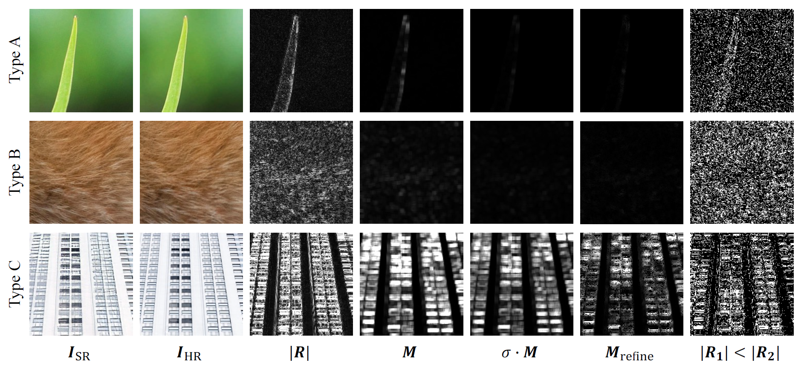

# LDL

### [Paper](https://liangjie.xyz/LjHomepageFiles/paper_files/LDL_CVPR2022_paper.pdf) |   [Supplementary Material](https://liangjie.xyz/LjHomepageFiles/paper_files/LDL_CVPR2022_suppl.pdf)

> **Details or Artifacts: A Locally Discriminative Learning Approach to Realistic Image Super-Resolution** <br>
> [Jie Liang\*](https://liangjie.xyz/), [Hui Zeng\*](https://huizeng.github.io/), and [Lei Zhang](https://www4.comp.polyu.edu.hk/~cslzhang/). <br>
> In CVPR 2022 (Oral Presentation).

### Abstract

Single image super-resolution (SISR) with generative adversarial networks (GAN) has recently attracted increasing attention due to its potentials to generate rich details. 
However, the training of GAN is unstable, and it often introduces many perceptually unpleasant artifacts along with the generated details. 
In this paper, we demonstrate that it is possible to train a GAN-based SISR model which can stably generate perceptually realistic details while inhibiting visual artifacts. 
Based on the observation that the local statistics (e.g., residual variance) of artifact areas are often different from the areas of perceptually friendly details, 
we develop a framework to discriminate between GAN-generated artifacts and realistic details, and consequently generate an artifact map to regularize and stabilize the model training process. 
Our proposed locally discriminative learning (LDL) method is simple yet effective, which can be easily plugged in off-the-shelf SISR methods and boost their performance. 
Experiments demonstrate that LDL outperforms the state-of-the-art GAN based SISR methods, 
achieving not only higher reconstruction accuracy but also superior perceptual quality on both synthetic and real-world datasets.

Overall illustration of the LDL:



For more details, please refer to our paper.

#### Getting started

- Clone this repo.
```bash
git clone https://github.com/csjliang/LDL
cd LDL
```

- Install dependencies. (Python 3 + NVIDIA GPU + CUDA. Recommend to use Anaconda)
```bash
pip install -r requirements.txt
```

- Prepare the training and testing dataset by following this [instruction](datasets/README.md).
- Prepare the pre-trained models by following this [instruction](experiments/README.md).

#### Training

First, check and adapt the yml file ```options/train/LDL/train_Synthetic_LDL.yml``` (or ```options/train/LDL/train_Realworld_LDL.yml``` for real-world image super-resolution), then

- Single GPU:
```bash
PYTHONPATH="./:${PYTHONPATH}" CUDA_VISIBLE_DEVICES=0 python basicsr/train.py -opt options/train/LDL/train_Synthetic_LDL.yml --auto_resume
```
or
```bash
PYTHONPATH="./:${PYTHONPATH}" CUDA_VISIBLE_DEVICES=0 python realesrgan/train.py -opt options/train/LDL/train_Realworld_LDL.yml --auto_resume
```

- Distributed Training:
```bash
PYTHONPATH="./:${PYTHONPATH}" CUDA_VISIBLE_DEVICES=0,1,2,3 python -m torch.distributed.launch --nproc_per_node=4 --master_port=5678 basicsr/train.py -opt options/train/LDL/train_Synthetic_LDL.yml --launcher pytorch --auto_resume
```
or 
```bash
PYTHONPATH=":${PYTHONPATH}" CUDA_VISIBLE_DEVICES=0,1,2,3 python -m torch.distributed.launch --nproc_per_node=4 --master_port=4321 realesrgan/train.py -opt options/train/LDL/train_Realworld_LDL.yml --launcher pytorch --auto_resume
```

Training files (logs, models, training states and visualizations) will be saved in the directory ```./experiments/{name}```

#### Testing

First, check and adapt the yml file ```options/test/LDL/test_LDL_Synthetic_x4.yml``` (or ```options/test/LDL/test_LDL_Realworld_x4.yml``` for real-world image super-resolution), then

- Calculate metrics and save visual results for synthetic tasks:
```bash
PYTHONPATH="./:${PYTHONPATH}" CUDA_VISIBLE_DEVICES=0 python basicsr/test.py -opt options/test/LDL/test_LDL_Synthetic_x4.yml
```

- Save visual results for real-world image super-resolution:
```bash
PYTHONPATH="./:${PYTHONPATH}" CUDA_VISIBLE_DEVICES=0 python basicsr/test.py -opt options/test/LDL/test_LDL_Realworld_x4.yml
```

Evaluating files (logs and visualizations) will be saved in the directory ```./results/{name}```

The Training and testing steps for scale=2 are similar.

#### Get Quantitative Metrics

First, check and adapt the settings of the files in [metrics](scripts/metrics), then (take PSNR as an example) run
```bash
PYTHONPATH="./:${PYTHONPATH}" python scripts/metrics/table_calculate_psnr_all.py
```
Other metrics are similar.

### License

This project is released under the Apache 2.0 license.

### Citation
```
@inproceedings{jie2022LDL,
  title={Details or Artifacts: A Locally Discriminative Learning Approach to Realistic Image Super-Resolution},
  author={Liang, Jie and Zeng, Hui and Zhang, Lei},
  booktitle={Proceedings of the IEEE Conference on Computer Vision and Pattern Recognition},
  year={2022}
}
```

### Acknowledgement
This project is built based on the excellent [BasicSR](https://github.com/xinntao/BasicSR) project.

### Contact
Should you have any questions, please contact me via `liang27jie@gmail.com`.
